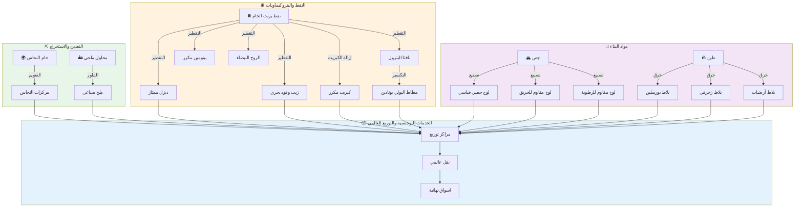
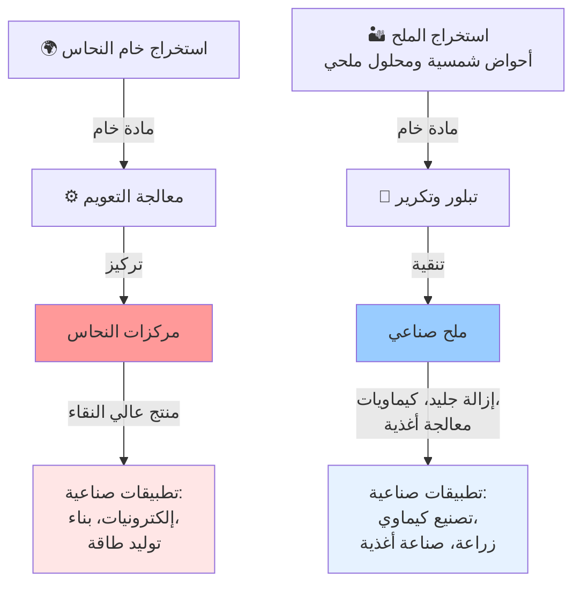
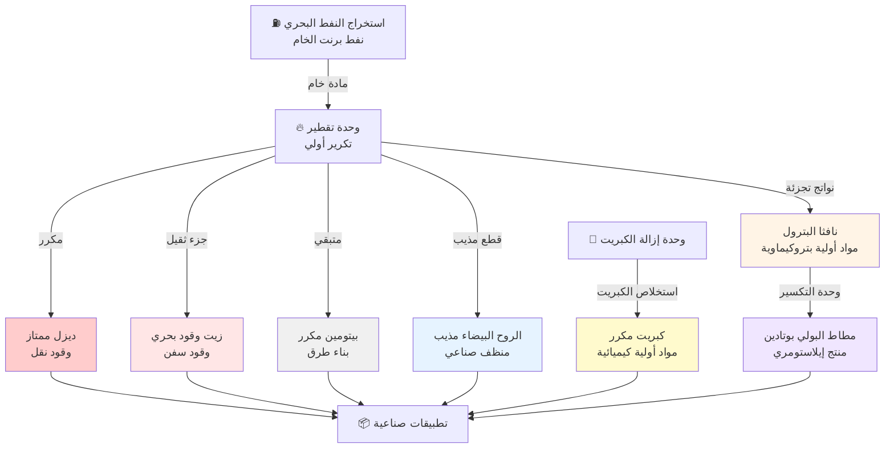
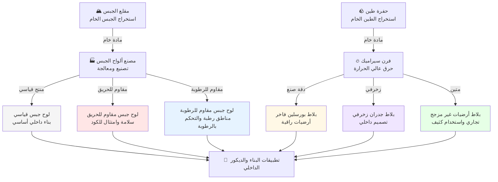

## نظرة عامة

تمتد سلسلة التوريد المتكاملة لدينا عبر ثلاث سلاسل قيمة أولية، تتقارب عند شبكات التوزيع العالمية لخدمة أسواق صناعية وتجارية متنوعة في جميع أنحاء العالم.

### شبكة سلسلة التوريد الكاملة

---

## سلسلة التوريد للتعدين والاستخراج

---

## سلسلة توريد النفط والبتروكيماويات

---

## سلسلة توريد مواد البناء

القطاعات والمنتجات

* النفط والبتروكيماويات
* المواد الكيميائية والبوليمرات
* المعادن والخامات
* الزراعة والأغذية
* الآلات والمعدات
* السلع الاستهلاكية
