Our integrated supply chain spans raw material extraction through processing, manufacturing, and global distribution across all our product lines.

  <button class="btn btn-sm btn-outline-primary" onclick="zoomIn()" title="Zoom In"><i class="bi bi-zoom-in"></i></button>
  <button class="btn btn-sm btn-outline-primary" onclick="zoomOut()" title="Zoom Out"><i class="bi bi-zoom-out"></i></button>
  <button class="btn btn-sm btn-outline-primary" onclick="resetZoom()" title="Reset"><i class="bi bi-arrows-fullscreen"></i></button>
  <i class="bi bi-mouse"></i> Drag to pan &middot; Scroll to zoom

```mermaid
%%{init: {'securityLevel': 'loose', 'flowchart': {'htmlLabels': true, 'nodeSpacing': 80, 'rankSpacing': 60}}}%%
graph TD

  subgraph raw["RAW MATERIALS"]
    direction TB
    R1["Crude Oil<br/><small>Brent</small>"]
    R2["Copper Ore"]
    R3["Salt Brine"]
    R4["Gypsum Rock"]
    R5["Clay"]
    R6["Limestone"]
  end

  subgraph refining["REFINING &amp; PROCESSING"]
    direction TB
    P1["Distillation Unit"]
    P2["Desulfurization"]
    P3["Cracking Unit"]
    P4["Flotation<br/>Concentration"]
    P5["Crystallization"]
    P6["Gypsum Board<br/>Manufacturing"]
    P7["Ceramic Kiln<br/>Firing"]
    P8["Chemical<br/>Synthesis"]
  end

  subgraph products["OUR PRODUCTS"]
    direction TB
    D1["Premium Diesel"]
    D2["Marine Fuel Oil"]
    D3["Petroleum Naphtha"]
    D4["Bitumen 60/70"]
    D5["White Spirit 402"]
    D6["Refined Sulfur"]
    D7["Polybutadiene<br/>Rubber"]
    D8["Copper<br/>Concentrate"]
    D9["Industrial Salt"]
    D10["Caustic Soda<br/>Flakes"]
    D11["Calcium<br/>Chloride"]
    D12["Calcium<br/>Hypochlorite"]
    D13["Sodium<br/>Hypochlorite"]
    D14["Standard Gypsum<br/>Wallboard"]
    D15["Fire-Resistant<br/>Gypsum Board"]
    D16["Moisture-Resistant<br/>Gypsum Board"]
    D17["Premium Porcelain<br/>Tiles"]
    D18["Decorative Wall<br/>Tiles"]
    D19["Unglazed Floor<br/>Tiles"]
  end

  subgraph markets["END MARKETS"]
    direction TB
    M1["Transportation<br/>&amp; Fuel"]
    M2["Construction<br/>&amp; Infrastructure"]
    M3["Chemical<br/>Manufacturing"]
    M4["Industrial<br/>Processing"]
    M5["Water Treatment<br/>&amp; Sanitation"]
    M6["Marine &amp;<br/>Shipping"]
  end

  subgraph logistics["GLOBAL LOGISTICS"]
    L1["Distribution<br/>Centers"]
    L2["Ocean &amp; Air<br/>Freight"]
    L3["Regional<br/>Warehousing"]
  end

  R1 --> P1
  P1 --> D1
  P1 --> D2
  P1 --> D3
  P1 --> D4
  P1 --> D5
  R1 --> P2
  P2 --> D6
  D3 --> P3
  P3 --> D7

  R2 --> P4
  P4 --> D8

  R3 --> P5
  P5 --> D9

  R6 --> P8
  P8 --> D10
  P8 --> D11
  P8 --> D12
  P8 --> D13

  R4 --> P6
  P6 --> D14
  P6 --> D15
  P6 --> D16

  R5 --> P7
  P7 --> D17
  P7 --> D18
  P7 --> D19

  D1 --> L1
  D2 --> L1
  D3 --> L1
  D4 --> L1
  D5 --> L1
  D6 --> L1
  D7 --> L1
  D8 --> L1
  D9 --> L1
  D10 --> L1
  D11 --> L1
  D12 --> L1
  D13 --> L1
  D14 --> L1
  D15 --> L1
  D16 --> L1
  D17 --> L1
  D18 --> L1
  D19 --> L1

  L1 --> L2
  L2 --> L3
  L3 --> M1
  L3 --> M2
  L3 --> M3
  L3 --> M4
  L3 --> M5
  L3 --> M6

  style raw fill:#f0f4c3,stroke:#9e9d24
  style refining fill:#fff9c4,stroke:#f9a825
  style products fill:#e3f2fd,stroke:#1565c0
  style markets fill:#fce4ec,stroke:#c62828
  style logistics fill:#e8f5e9,stroke:#2e7d32
```

---

Our supply chain connects global raw material sources to industrial and commercial markets through a network of processing facilities, manufacturing plants, and distribution channels. All products listed are available through our verified supplier network.
