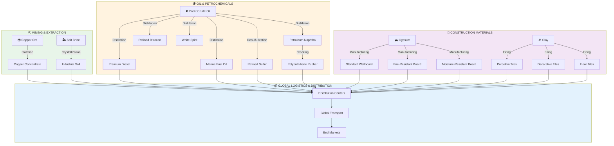
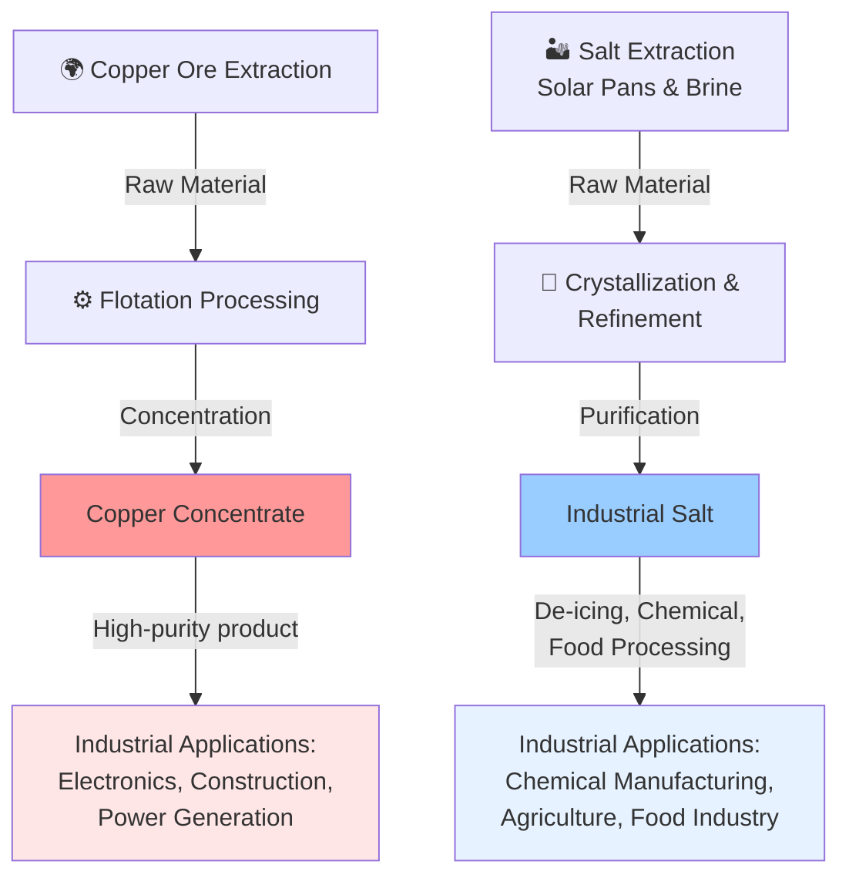
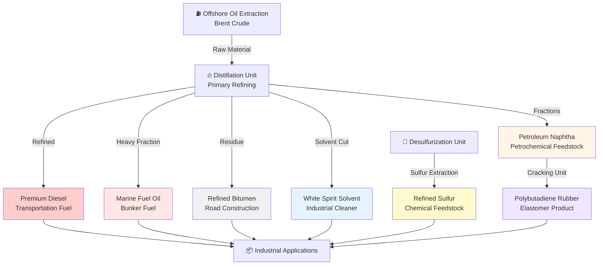
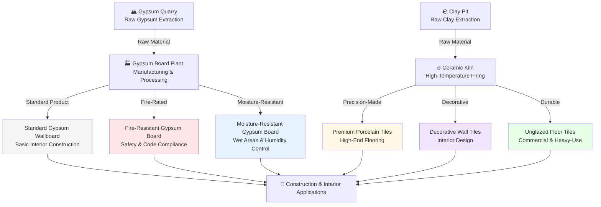

## Overview

Our integrated supply chain spans three primary value chains, converging at global distribution networks to serve diverse industrial and commercial markets worldwide.

### Complete Supply Chain Network

---

## Mining & Extraction Supply Chain

---

## Oil & Petrochemicals Supply Chain

---

## Construction Materials Supply Chain

